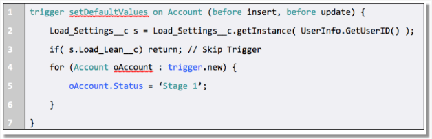

# Triggers

```apex
triger AccountTrigger on Account(before insert, after insert, before update, after update, before delete, after delete){

	if(Trigger.isBefore && Trigger.isInsert){
		AccountTriggerHandler.onBeforeInsert(Trigger.old, Trigger.oldMap, Trigger.new, Trigger.newMap);
	}
	if(Trigger.isAfter && Trigger.isInsert){
		AccountTriggerHandler.onAfterInsert(Trigger.old, Trigger.oldMap, Trigger.new, Trigger.newMap);
	}
	if(Trigger.isBefore && Trigger.isUpdate){
		AccountTriggerHandler.onBeforeUpdate(Trigger.old, Trigger.oldMap, Trigger.new, Trigger.newMap);
	}
	if(Trigger.isAfter && Trigger.isUpdate){
		AccountTriggerHandler.onAfterUpdate(Trigger.old, Trigger.oldMap, Trigger.new, Trigger.newMap);
	}
	if(Trigger.isBefore && Trigger.isDelete){
		AccountTriggerHandler.onBeforeDelete(Trigger.old, Trigger.oldMap, Trigger.new, Trigger.newMap);
	}
	if(Trigger.isAfter && Trigger.isDelete){
		AccountTriggerHandler.onAfterDelete(Trigger.old, Trigger.oldMap, Trigger.new, Trigger.newMap);
	}

}

```

where trigger_events can be a comma-separated list of one or more of the following events:
* before insert
* before update
* before delete
* after insert
* after update
* after delete
* after undelete


## Apex Trigger - Bulk Request
```
Trigger MileageTrigger on Mileage__c (before insert, before update) {

               Set<ID> ids = Trigger.newMap.keySet();
               List<User> c = [SELECT Id FROM user WHERE mileageid__c in :ids];

}
```

## Apex Trigger - Pre-Delete validation   
trigger oppTrigger on Opportunity (before delete) {

```
   for (Quote__c q : [SELECT opportunity__c 
                        FROM quote__c 
                       WHERE opportunity__c IN :Trigger.oldMap.keySet()
                     ]){       
        
        Trigger.oldMap.get(q.opportunity__c).addError('Cannot delete opportunity with a quote');
   
   }

}
```

### Enable/Disable trigger on the fly

