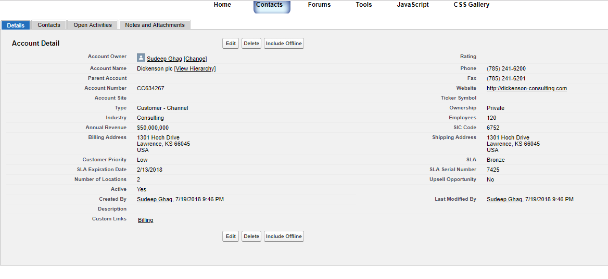
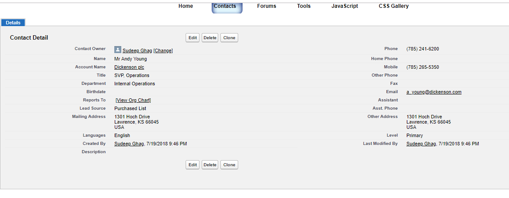

## Implementation of Common Header-Footer

https://brave-goat-447291-dev-ed--c.na53.visual.force.com/apex/vfAccountPage?Id=001f200001afIAK

https://brave-goat-447291-dev-ed--c.na53.visual.force.com/apex/vfContactPage?Id=003f200002Reh7w






``` javascript
    
    <apex:includeScript value="{! URLFOR($Resource.HeaderFooter,'HeaderFooter_v3/jquery_v1_5_2.min.js')}"/>
    <apex:includeScript value="{! URLFOR($Resource.HeaderFooter,'HeaderFooter_v3/gooeymenu.js')}"/>	
    <apex:stylesheet value="{! URLFOR($Resource.HeaderFooter,'HeaderFooter_v3/gooeymenu.css')}"/>	
    
```


``` javascript
    
ul.gelbuttonmenu li.active{ /*style of LI that gets dynamically added to menu to create background effect*/
position:absolute;
width:0;
background:lightblue;
background:url(./gelbuttons/gelbuttonleft.gif) top left no-repeat, url(./gelbuttons/gelbuttonright.gif) top right no-repeat, url(./gelbuttons/gelbuttoncenter.gif) top center repeat-x;
}


    
```
